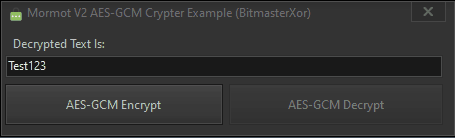

<h1>AES-GCM Encryption/Decryption Delphi Project</h1>

This Delphi VCL application demonstrates AES-GCM encryption and decryption using the mORMot cryptographic components. It provides a simple GUI for encrypting and decrypting text with a secure AES-GCM implementation.

<!-- Replace 'screenshot.png' with the path to your actual image file -->

  

<h2>Features</h2>
<ul>
  <li><strong>Encrypt Text:</strong> Encrypts plaintext using AES-GCM with a randomly generated key and nonce.</li>
  <li><strong>Decrypt Text:</strong> Decrypts base64-encoded ciphertext back to plaintext.</li>
  <li><strong>User-Friendly Interface:</strong> Intuitive interface with buttons for encryption and decryption.</li>
</ul>

<h2>Installation</h2>
<ol>
  <li><strong>Open Delphi Project:</strong> Open the `.dpr` file in the Delphi IDE.</li>
  <li><strong>Compile:</strong> Build the project to generate the executable.</li>
  <li><strong>Run:</strong> Execute the application to start using it.</li>
</ol>

<h2>Usage</h2>
<ol>
  <li><strong>Launch the Application:</strong> Run the tool from Delphi or the generated executable.</li>
  <li><strong>Encrypt Text:</strong> Enter plaintext in the text box and click the "Encrypt" button to generate and display the encrypted text.</li>
  <li><strong>Decrypt Text:</strong> Enter the base64-encoded ciphertext in the text box and click the "Decrypt" button to retrieve and display the plaintext.</li>
</ol>

<h2>Contributing</h2>

Contributions are welcome! If you have suggestions or bug fixes, please fork the repository and submit a pull request.

<h2>License</h2>

This project is provided "as is" without warranty. Use it at your own risk.

## 📧 Contact

Discord: BitmasterXor

Made with ❤️ by: BitmasterXor, using Delphi RAD Studio

